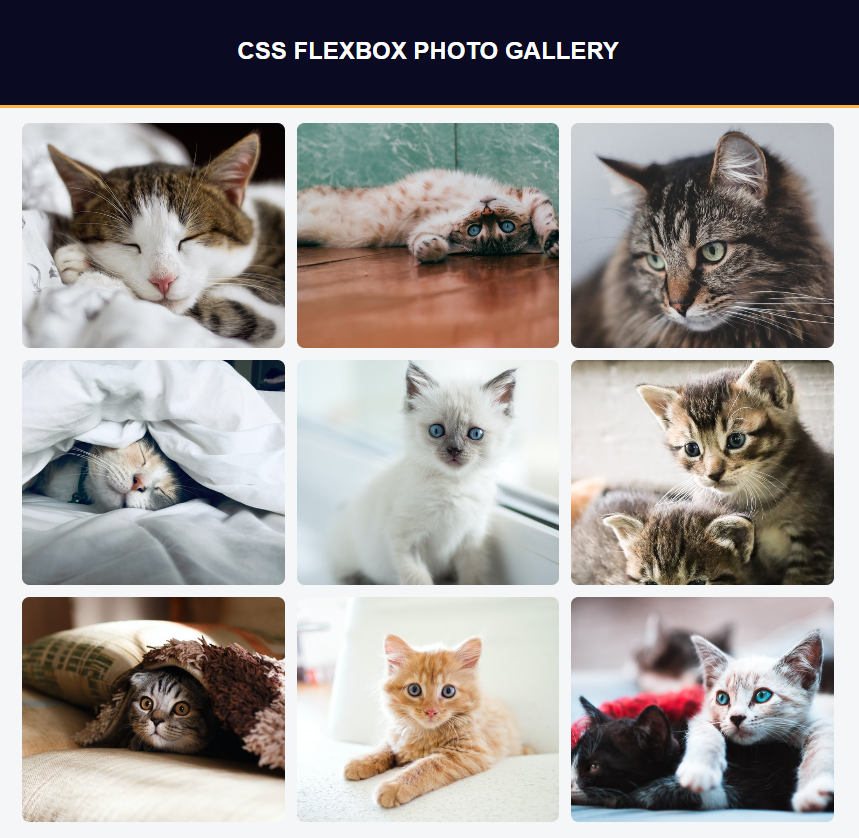

# Photo Gallery

A responsive photo gallery project built using HTML and CSS as part of the FreeCodeCamp Responsive Web Design certification course.

## Description

This project showcases a collection of images arranged in a visually appealing grid layout. Created as part of the FreeCodeCamp curriculum, I followed the guidelines provided to implement a responsive design using Flexbox. The gallery displays a variety of cat images, adapting seamlessly to different screen sizes.

## Features

- Responsive design that adapts to different screen sizes.
- High-quality images displayed in a grid layout.
- Images are styled with rounded corners for a modern look.
- Flexbox used for consistent spacing and alignment.

## Technologies Used

- HTML
- CSS

## How to Run

1. Clone the repository to your local machine.
2. Open `photoGallery.html` in your web browser.

## Acknowledgments

This project was completed as part of the FreeCodeCamp Responsive Web Design certification course. Special thanks to FreeCodeCamp for providing the resources and guidance.
